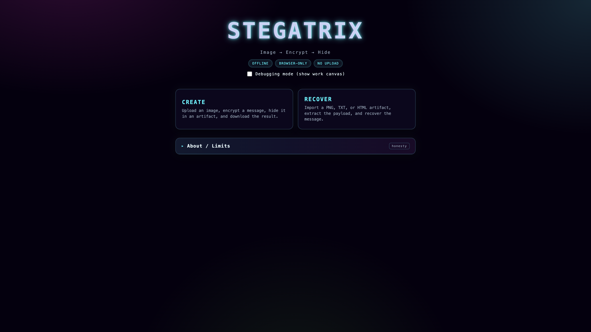
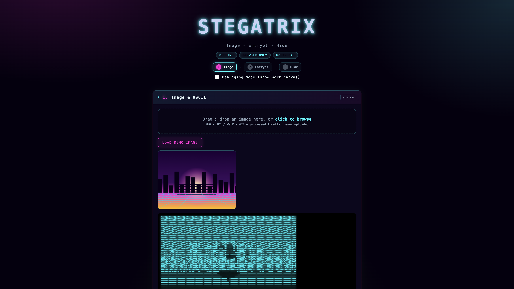
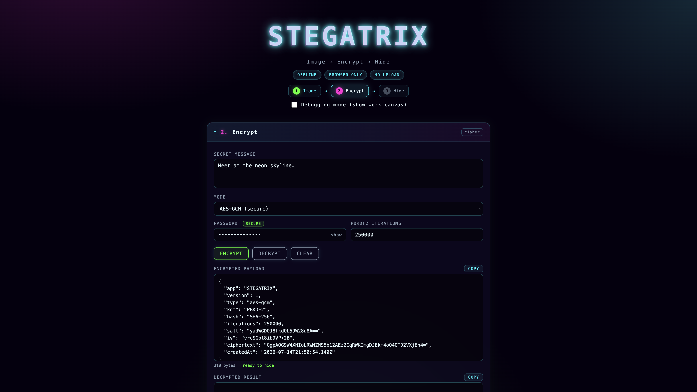
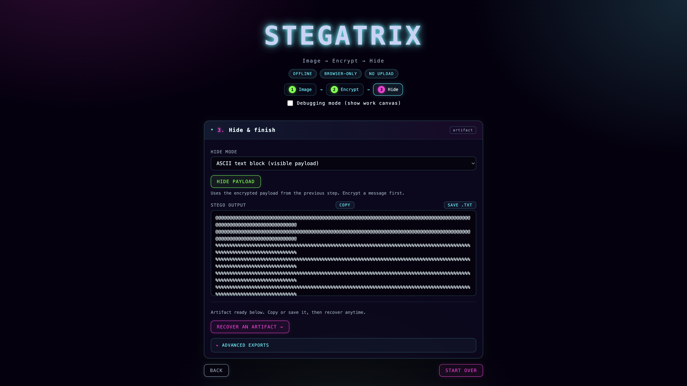
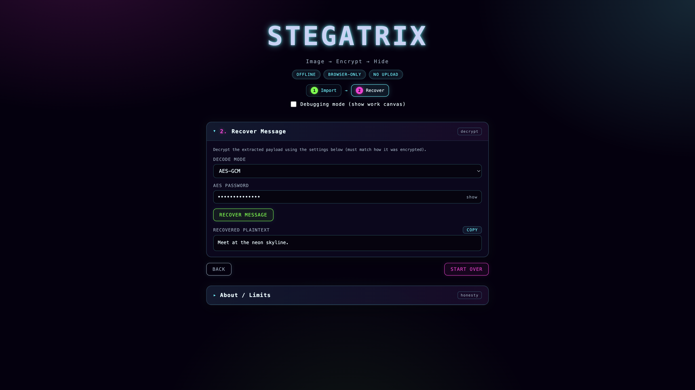

# Stegatrix

**Image → Encrypt → Hide**

Stegatrix is a self-contained, offline, single-file web app that turns an image
into cyberpunk ASCII art, encrypts a secret message, hides the encrypted payload
inside a carrier (ASCII text, PNG pixels, HTML, or zero-width characters), and
recovers it later. Everything runs locally in your browser — no backend, no build
step, no dependencies, and nothing is ever uploaded.

The UI is a stepped wizard: **Create** (3 steps) or **Recover** (2 steps).



---

## Table of contents

- [Concept](#concept)
- [How to run](#how-to-run)
- [Screenshots](#screenshots)
- [Features](#features)
- [Quick start](#quick-start)
- [Security notes](#security-notes)
- [Known limitations](#known-limitations)
- [Future upgrades](#future-upgrades)
- [Internal format identifiers](#internal-format-identifiers)

---

## Concept

The image is a **visual carrier**, not data storage. ASCII conversion is
intentionally **lossy** — the original image is never reconstructed from ASCII.
The real data path is:

```
Secret message ─▶ Cipher / AES-GCM ─▶ JSON payload ─▶ Stego carrier ─▶ Artifact
Artifact ─▶ Import ─▶ Decrypt ─▶ Recovered message
```

### Create path (3 steps)

1. **Image & ASCII** — upload (or load the demo), preview ASCII; tunables sit under *Tune ASCII*.
2. **Encrypt** — message + cipher mode → encrypted payload.
3. **Hide & finish** — choose a carrier, hide the payload (PNG/HTML download; ASCII/zero-width copy/save), then recover anytime.

### Recover path (2 steps)

1. **Import** — drop or paste a PNG / TXT / HTML artifact and extract the payload.
2. **Recover** — decrypt with matching mode/password and read the plaintext.

---

## How to run

No install, no server, no build.

1. Download `index.html`.
2. Open it in any modern browser (Chrome, Edge, Firefox, Safari) — double-click or drag it into a tab.

That's it. The entire app (HTML + CSS + JS) lives in that one file.

> AES-GCM uses the browser's Web Crypto API, which is available on `file://`, `http://localhost`, and any `https://` origin.

Live demo: [atahan99.github.io/Stegatrix](https://atahan99.github.io/Stegatrix/) · Source: [github.com/atahan99/Stegatrix](https://github.com/atahan99/Stegatrix)

---

## Screenshots

**Create step 1 — Image & ASCII (demo image + neon preview)**



**Create step 2 — Encrypt (AES-GCM payload ready to hide)**



**Create step 3 — Hide & finish (ASCII carrier + Recover CTA)**



**Recover step 2 — decrypted plaintext**



---

## Features

### Wizard navigation
- Home path cards: **Create** or **Recover**.
- Live step strip; **Next** unlocks only after that step’s action.
- Title click / **Start over** returns home.
- Debug canvas toggle stays in the header; About / Limits stays in the footer.

### Image → ASCII
- Drag-and-drop or click-to-browse upload, plus a built-in **Load demo image**.
- Controls (under *Tune ASCII*): ASCII width (40–240), brightness, contrast, invert, color mode, font size, line height, charset, render theme.
- Character sets: **Dense**, **Blocks**, **Binary**, **Cyber**, **Minimal**, or **Custom**.
- Render themes: **monochrome neon**, **color (pixel color)**, **amber terminal**, **matrix green**, **magenta/cyan split glow**.
- Copy ASCII, download `.txt`, or export the ASCII art as a PNG raster.
- Optional debug view of the sampling canvas.

### Encrypt
- **None / Base64 wrapper** — encoding only, not encryption.
- **Caesar**, **Atbash**, **Vigenère**, **XOR** — *puzzle / aesthetic ciphers, clearly labelled not secure*.
- **AES-GCM** — *secure mode*: PBKDF2-SHA256 key derivation (default 250,000 iterations), 256-bit key, random 16-byte salt, random 12-byte IV.
- AES payload is a JSON object: `app, version, type, kdf, hash, iterations, salt, iv, ciphertext, createdAt`.
- Password show/hide toggle, live payload byte-size readout, and one-click copy on every output.

### Hide & finish
- **ASCII text block** — appends a `---BEGIN/END STEGATRIX PAYLOAD---` block below the art (Copy or Save `.txt`).
- **PNG (hidden in image)** — LSB embed; magic `STGTRX1` + length + UTF-8 payload; live capacity estimator; downloads a PNG.
- **HTML page (self-contained)** — downloads a page with ASCII plus `<script type="application/json" id="stegatrix-payload">`.
- **Zero-width text** (experimental) — invisible characters inside a cover sentence.
- After a successful hide: finish strip with **Recover an artifact**, plus *Advanced exports* (payload JSON, README/instructions TXT).

### Import / Recover
- Import a **PNG / TXT / HTML** file, **or paste artifact text**.
- Auto-detects the carrier: HTML script tag, ASCII block, zero-width data, or PNG LSB.
- Next unlocks after extract; decrypt with matching mode/password on the Recover step.

---

## Quick start

1. Open the app → choose **Create**.
2. Click **Load demo image** (or drop your own), then **Next**.
3. Type a message, pick **AES-GCM (secure)**, enter a password, click **Encrypt**, then **Next**.
4. Choose a hide mode and click **Hide payload** (PNG/HTML download instantly; ASCII/zero-width appear in the output — use Copy or Save `.txt`).
5. To recover: **Recover an artifact** (or home → **Recover**), import the file or paste text, **Next**, set the matching decode mode/password, click **Recover message**.

---

## Security notes

- **ASCII conversion is lossy and visual only.** You cannot rebuild the image from ASCII.
- **Classical ciphers (Caesar, Atbash, Vigenère, XOR) are puzzles, not security.**
- **AES-GCM is the secure option.** Use a strong, unique password.
- **LSB steganography is fragile.** It survives only lossless PNG. JPEG/WebP re-encoding, resizing, screenshots, and most social-media uploads will destroy the hidden bits.
- **Zero-width stego is experimental** and is often stripped by websites, editors, and messengers.
- **All processing happens locally in your browser.** No network requests, no uploads.

---

## Known limitations

- Very large images are capped during ASCII sampling to keep the browser responsive.
- PNG LSB capacity depends on image resolution; large AES payloads need larger images.
- Zero-width payloads can be silently removed by many text surfaces.
- Color ASCII uses one `<span>` per character, so extremely wide outputs are heavier to render.

---

## Future upgrades

- Optional payload compression before embedding.
- Password strength meter and configurable KDF presets.
- Error-correction coding for more robust LSB.
- Additional carriers (audio, SVG metadata).

---

## Internal format identifiers

These constants are used identically on the write and read paths, so artifacts round-trip cleanly.

| Purpose             | Value                               |
|---------------------|-------------------------------------|
| PNG magic header    | `STGTRX1`                           |
| ASCII block markers | `---BEGIN/END STEGATRIX PAYLOAD---` |
| HTML payload id     | `stegatrix-payload`                 |
| Payload `app` field | `STEGATRIX`                         |

---

## Verified flows

All core flows were tested end-to-end in a real browser:

- Wizard gates: Create Next locked until image/encrypt; Recover Next locked until extract.
- Base64 / Caesar / Atbash / Vigenère / XOR / AES-GCM encrypt + decrypt round-trips.
- AES-GCM fails cleanly with the wrong password.
- Image → ASCII across character sets and every render theme.
- Hide → import → decrypt for all four carriers (ASCII block, PNG LSB, HTML, zero-width).
- PNG LSB capacity estimator and over-capacity warning.
- Paste-to-decode and Save `.txt` from the Stego output.
